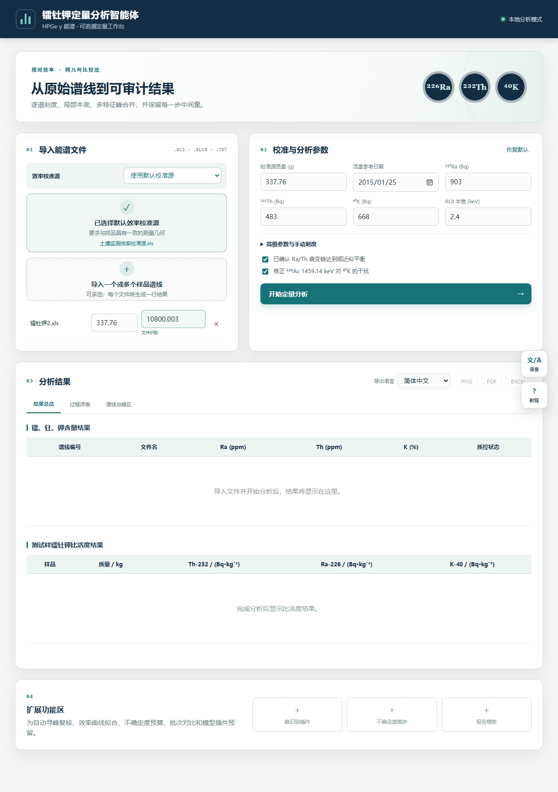

# Ra–Th–K Quantitative 1

<p align="center">
  
</p>

面向土壤高纯锗（HPGe）γ 能谱的镭-钍-钾定量分析 Agent Skill。它把谱线解析、活时间读取、能量刻度、特征峰积分、效率标准源相对测量、比活度/含量计算、质量核查和中英文报告导出整合在一个本地可视化工作台中。

> 本项目是辅助计算与可追溯报告工具，不是经认证的实验室测量系统。使用者仍需对样品制备、标准源溯源、测量几何一致性、衰变链平衡、探测限和不确定度负责。



## 主要能力

- 导入 `.xls`、`.xlsx`、`.txt`、`.csv`、`.dat` 能谱；支持一次导入多个测试样。
- 识别 `TLIVE`、`LIVE TIME`、`活时间` 等元数据；无法识别时允许手动输入。
- 内置项目效率校准源，也可上传与测试样测量几何匹配的自定义标准源。
- 自动拟合 `E = a × CH + b`，同时报告相关系数 `R`、百分比偏差和 RMS 残差。
- 对 Ra-226、Th-232、K-40 主要特征峰进行局部本底扣除与净峰计数分析。
- 输出 Bq/kg 比活度，以及常规 Ra/Th ppm 和 K 百分含量换算结果。
- 多样品比活度柱状对比、每个测试样的原始能谱图和能量刻度拟合图。
- 中文/English 双语界面与双语 PNG、PDF、Excel 报告。
- Excel 报告同时写入稳定显示的拟合图图片和可编辑的原生散点图。
- 保留峰位、总计数、本底、净计数、净计数率、拟合指标和警告，便于复核。

## 快速开始

### 1. 下载

```bash
git clone https://github.com/twinkle-air/ra-th-k-quantitative-1.git
cd ra-th-k-quantitative-1
```

### 2. 安装到 Agent 工具

一次安装到 Codex、Claude Code、WorkBuddy 和 CodeBuddy 的用户级目录：

```bash
python scripts/install.py --tool all --scope user
```

也可只安装到一种工具：

```bash
python scripts/install.py --tool codex --scope user
python scripts/install.py --tool claude --scope user
python scripts/install.py --tool workbuddy --scope user
python scripts/install.py --tool codebuddy --scope user
```

项目级安装示例：

```bash
python scripts/install.py --tool all --scope project --project-root /path/to/your/project
```

安装器默认拒绝覆盖已有 Skill。确需更新时加 `--force`；旧版本会先移动到带时间戳的备份目录。

### 3. 启动可视化工作台

需要 Python 3.10 或更高版本。首次运行自动建立独立虚拟环境并安装依赖：

```bash
python scripts/start_app.py --install
```

以后运行：

```bash
python scripts/start_app.py
```

浏览器打开 `http://127.0.0.1:8000/`。服务只监听本机回环地址，谱线不会由本项目主动上传到云端。

## 在不同 Agent 中调用

本仓库遵循开放的 [Agent Skills 规范](https://agentskills.io/specification)，入口文件为根目录 `SKILL.md`。

| 工具 | 用户级安装位置 | 项目级安装位置 | 调用方式 |
|---|---|---|---|
| Codex | `~/.agents/skills/ra-th-k-quantitative-1` | `.agents/skills/ra-th-k-quantitative-1` | `$ra-th-k-quantitative-1`，或直接描述分析任务 |
| Claude Code | `~/.claude/skills/ra-th-k-quantitative-1` | `.claude/skills/ra-th-k-quantitative-1` | `/ra-th-k-quantitative-1`，或直接描述分析任务 |
| WorkBuddy | `~/.workbuddy/skills/ra-th-k-quantitative-1` | `.workbuddy/skills/ra-th-k-quantitative-1` | 要求 Agent 使用该 Skill |
| CodeBuddy | `~/.codebuddy/skills/ra-th-k-quantitative-1` | `.codebuddy/skills/ra-th-k-quantitative-1` | 要求 Agent 使用该 Skill |

不同产品版本的自动发现行为可能变化；若安装后未出现，请重启工具或新建会话，并明确指定 Skill。Codex 和 Claude Code 的路径与调用方式分别参见其官方 [Codex Skills 文档](https://learn.chatgpt.com/docs/build-skills) 和 [Claude Code Skills 文档](https://code.claude.com/docs/en/skills)。

## 实际使用步骤

1. **确认测量条件**：标准源与样品应使用同一探测器，并尽可能保持容器、填充高度、相对位置和基质/自吸收条件一致。
2. **选择效率标准源**：仅在匹配原项目测量条件时使用内置标准源；其他数据应上传有证书、可溯源且几何匹配的效率标准源谱线。
3. **导入测试样谱线**：可多选。程序会尝试读取活时间；没有可靠元数据时必须手动填写秒数。
4. **填写样品量**：逐个输入净样品质量，单位为 g。程序不会根据文件名猜测质量。
5. **检查参数**：确认源参考日期、活度、ROI 半宽、本底间隔/窗口、Ra/Th 平衡假设和 K-40 干扰修正设置。
6. **开始定量分析**：程序为每条谱线单独完成能量刻度与峰区计算。
7. **复核结果**：查看比活度、含量、过程详表、样品能谱与拟合；同时检查 `R / 偏差 / RMS`、有效峰数和所有警告。
8. **选择导出语言**：分别生成中文或英文 PNG、PDF、Excel 文件；确认导出的拟合图包含拟合直线和刻度匹配点。

更细的输入与质控要求见 [references/INPUTS_AND_QC.md](references/INPUTS_AND_QC.md)，算法边界见 [references/METHOD.md](references/METHOD.md)，故障排查见 [references/TROUBLESHOOTING.md](references/TROUBLESHOOTING.md)。

## 主要特征峰与计算说明

默认分析候选线包括：

- Th-232 系：Pb-212 238.632 keV、Tl-208 583.187 keV、Ac-228 911.204 keV；
- Ra-226 系：Pb-214 295.224/351.932 keV、Bi-214 609.312 keV；
- K-40：1460.822 keV。

Ra-226 和 Th-232 通常通过子体 γ 线间接估算，因此“实际发射体”与“分析对象”在报告中分开列示。若密封静置、平衡状态或样品处理不足，不应把子体结果无条件等同于母体活度。

能量刻度拟合指标定义、含量换算因子和适用条件详见 [references/METHOD.md](references/METHOD.md)。正式实验室工作还应依据合法取得的 GB/T 11713-2015、GB/T 11743-2013 和本单位质量体系执行；本仓库不再分发标准全文。

## 开发与验证

运行结构检查、Python 编译和回归测试：

```bash
python scripts/verify.py
```

应用代码位于 `assets/app`，其独立启动方式为：

```bash
cd assets/app
python -m pip install -r requirements.txt
python -m uvicorn app.main:app --host 127.0.0.1 --port 8000
```

仓库结构：

```text
ra-th-k-quantitative-1/
├── SKILL.md                 # Agent Skill 入口与行为约束
├── agents/openai.yaml       # Codex/OpenAI 界面元数据
├── assets/app/              # FastAPI 分析应用、默认源和测试
├── references/              # 方法、输入质控、兼容性和排障说明
├── scripts/                 # 安装、启动和验证工具
├── README.md
└── LICENSE
```

## 科学与数据责任

- 输出属于辅助分析结果，不自动构成有资质的检验报告。
- 不应在没有探测限证据时将低于检出能力的数值当作可靠定量结果。
- 对自定义标准源，使用者负责证书活度衰变校正、核素信息和几何一致性。
- 修改算法或默认源后必须重新用有溯源的标准/质控样验证。
- 仓库不含用户提供的测试样谱线、比赛报告、国家标准 PDF 或其他未经授权的第三方材料。

## 许可证

代码以 [MIT License](LICENSE) 开源。国家标准、校准证书、用户数据和其他第三方材料不因本许可证而获得再分发授权。

## 作者与反馈

twinkle-air   邮箱：twinkleair369@gmai.com  或者twinkle-air@qq.com
